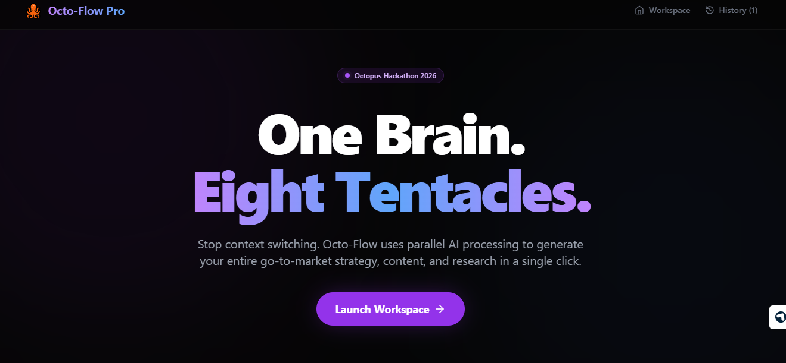
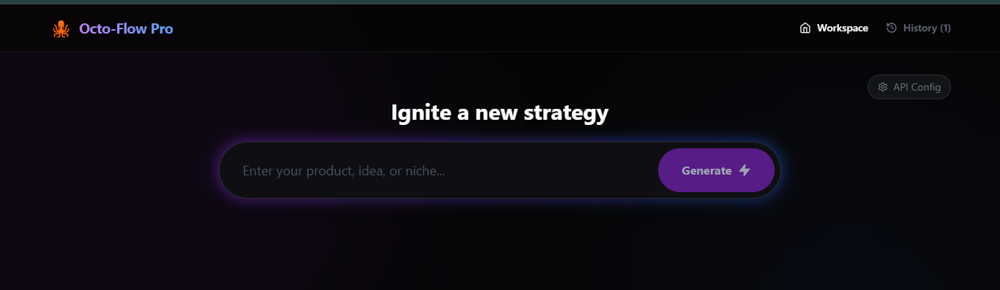
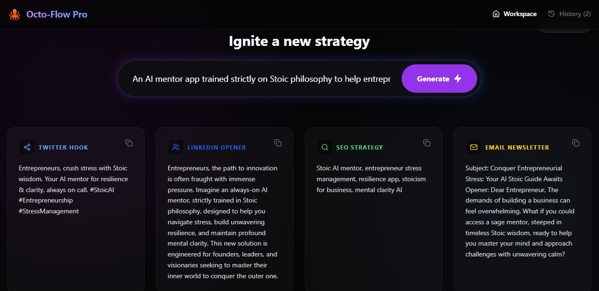
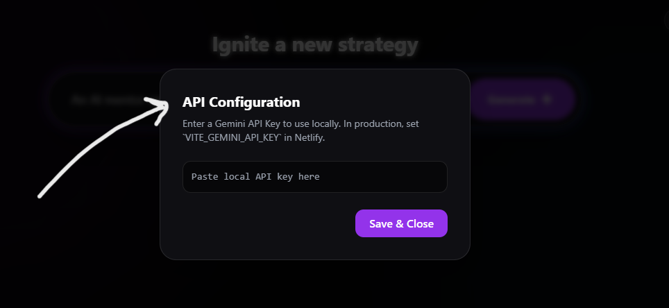

# 🐙 Octo-Flow Pro: The Parallel AI Strategist
> **One Brain. Eight Tentacles.** Stop context switching and generate your entire Go-To-Market strategy simultaneously.


**Octo-Flow Pro** is a multi-threaded AI workspace built for the **Octopus Hackathon 2026**. It solves the "Solopreneur Context Switching" problem by taking a single product idea and instantly generating 8 parallel workstreams (Tweets, SEO, Emails, Competitor Analysis, and more).

---

## 📸 The Workspace in Action

### Welcome


### Input the requirement (Workspace)


### The 8-Arm Engine Generating Strategy


### View the history


---

## 🧠 The "Bring Your Own Key" (BYOK) Architecture
To ensure Octo-Flow remains a **self-sustaining, free, and open-source public good** long after the hackathon, we engineered a Hybrid API Key architecture. 

1. **Hosted Demo Mode:** When you visit the live Netlify link, the app uses a securely injected `VITE_GEMINI_API_KEY` to provide a frictionless demo experience for judges and first-time users.
2. **BYOK Mode:** If the global API limit is reached, or if you want to run the app indefinitely for your own agency, you can click the **Settings (Gear Icon)** in the Navbar and paste your own Google Gemini API Key.

### Configure API


   * *Privacy First:* Your custom key is never sent to our servers. It is stored strictly in your browser's `localStorage` and sent directly to Google's API endpoint from the client.

---

## ⚡ Features: The 8 Tentacles
Instead of a linear chatbot, Octo-Flow forces the LLM to output a strict JSON schema, populating a parallel dashboard instantly:

1. **Share Tentacle:** Viral Twitter/X hooks and threads.
2. **Network Tentacle:** Professional LinkedIn B2B openers.
3. **Search Tentacle:** High-volume, low-competition SEO keywords.
4. **Outreach Tentacle:** High-converting Email subject lines and body copy.
5. **Brand Tentacle:** Punchy, memorable marketing slogans.
6. **Strategy Tentacle:** Immediate competitor analysis and differentiation.
7. **Psychology Tentacle:** Deep target audience persona profiling.
8. **Visual Tentacle:** Ready-to-use Midjourney/DALL-E image generation prompts.

---

## 🛠️ Tech Stack
We built this to be lightning-fast, deploying a monolithic-style client architecture that requires zero backend maintenance.

* **Frontend:** React 18, Vite
* **Styling:** Tailwind CSS (with custom Glassmorphism/Dark Mode config)
* **Icons:** Lucide React
* **AI Engine:** Google Gemini 2.5 Flash via REST API
* **State Management:** Custom React Hooks (`useLocalStorage`) for persistent generation history.
* **Deployment:** Netlify CI/CD

---

## 🚀 Local Setup

Want to run Octo-Flow on your own machine? It takes less than 60 seconds.

1. **Clone the repo**
   ```bash
   git clone [https://github.com/zumermalik/octoflow-ai.git](https://github.com/zumermalik/octoflow-ai.git)
   cd octoflow-ai

```

2. **Install dependencies**
```bash
npm install

```


3. **Add your Environment Variables**
Create a `.env` file in the root directory and add your Google Gemini API key:
```env
VITE_GEMINI_API_KEY=your_actual_key_here

```


4. **Start the development server**
```bash
npm run dev

```


---

## 🔭 Future Roadmap & Integrations

Octo-Flow is currently an MVP, but the "Octopus" architecture is designed to scale. Our future roadmap includes:

* **Export to Notion/PDF:** A 1-click button to compile the 8 cards into a beautiful PDF briefing document or push directly to a Notion database.
* **Direct Image Rendering:** Connecting Tentacle 8 directly to a stable diffusion API to actually render the visual prompt in the browser.
* **Webhooks / Zapier Integration:** Sending the generated email copy directly to Mailchimp, or scheduling the tweet via Typefully.
* **Custom Tentacles:** Allowing users to define their own 8 output types (e.g., swapping "SEO" for "Python Code Scaffolding").

---

*Built with ❤️ and 🐙 for the Octopus Hackathon 2026.*
